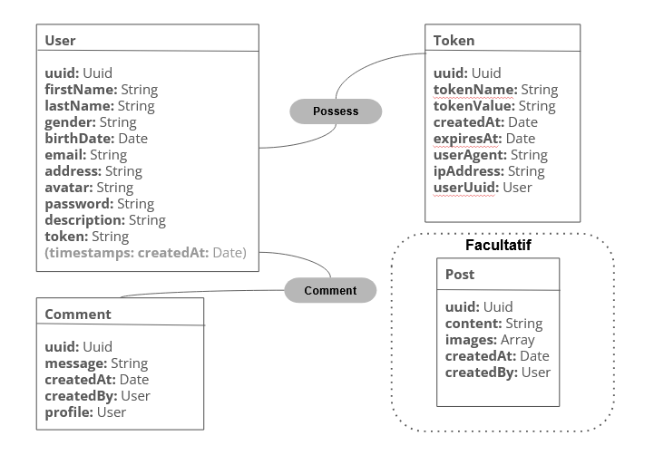

# Hackathon_Social_Media
> Small social media project

- [Hackathon\_Social\_Media](#hackathon_social_media)
  - [Built with](#built-with)
  - [Database](#database)
  - [Routes](#routes)

## Built with
This project uses the following languages, frameworks and tools:
1. Node / js
2. Vue
3. Vercel
4. Express
5. MongoDB
6. Swagger

## Database

## Routes
Find all the app routes by clicking on the following link: [Route documentation with Swagger](https://hackathon-social-media-backend-phi.vercel.app/api-docs/#/Auth/post_auth_login)